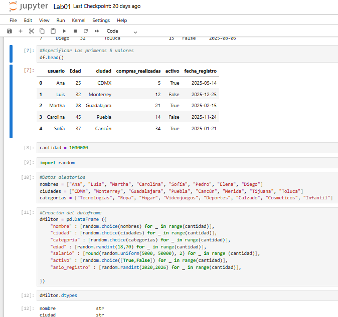
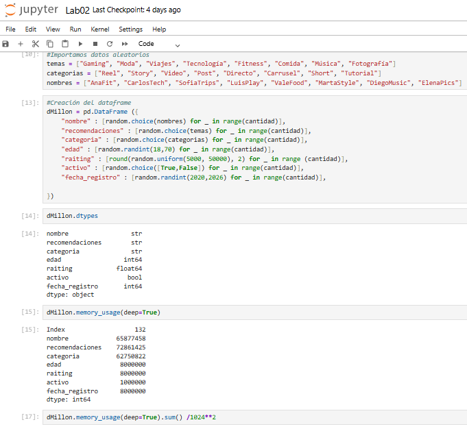
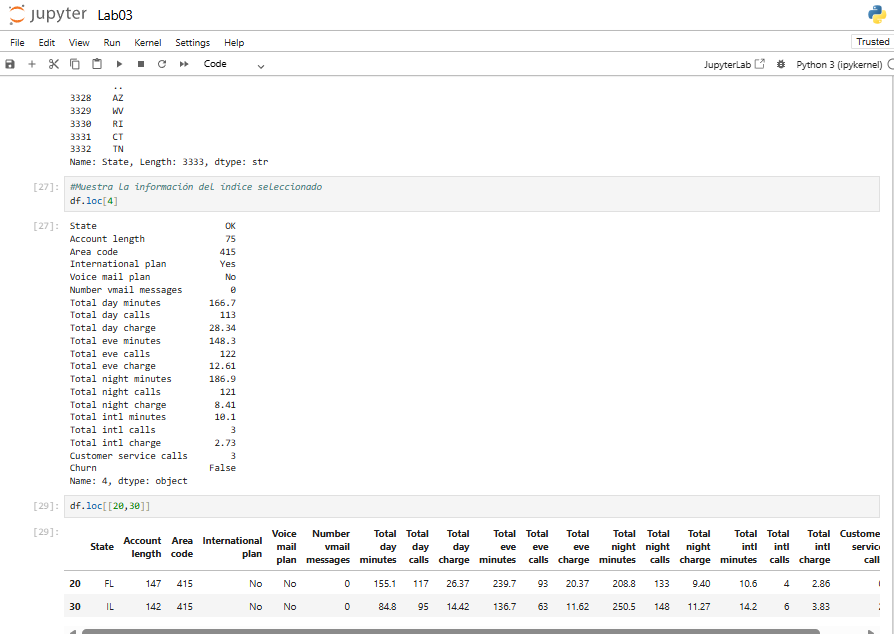
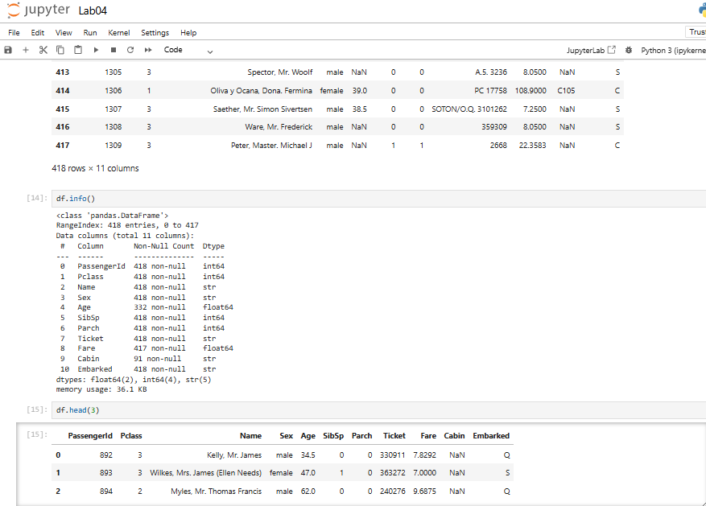
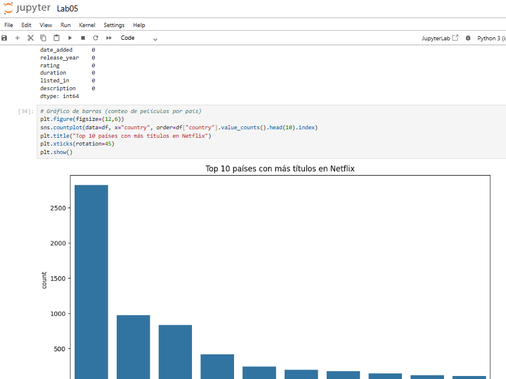
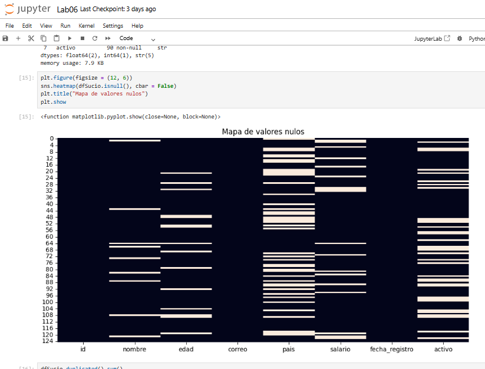
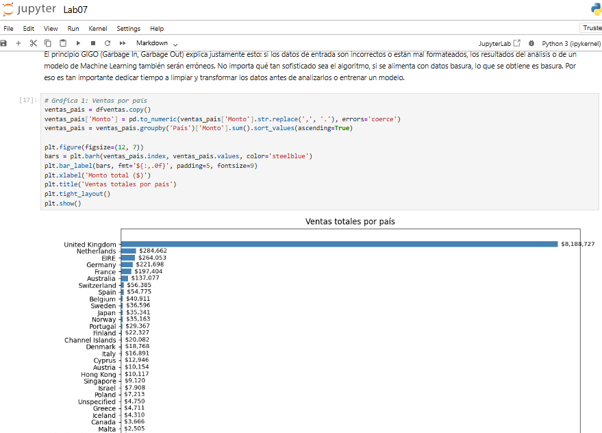

## Nombre: 
Oscar Iván Escamilla Guevara

## Materia: 
Extracción de conocimientos de bases de datos

## Grado y grupo: 
9 "B"

## Descripción general: 
Este repositorio contiene las prácticas de laboratorio de la materia de "Extracción de conocimientos de bases de datos", desarrollado con el objetivo de aprender a utilizar la herramiento notebook para la limpieza y visualización de datasets. Incluye el código fuente, documentación y ejemplos necesarios para comprender y ejecutar la solución.

## Objetivo: 
Aprender sobre los datasets, sus caracteristicas, comportamientos, propiedades, y el alcance que podemos tener trabajandolos y limpiandolos con ayuda de los compandos de python, y facilitandonos el desarrollo de código con Anaconda y Jupyter Notebook

## Datasets utilizados: 
dataset_sucio_practica, netflix_titles, test, ventas-por-factura, Data_Limpio_Factura

## Herramientas utilizadas: 
Anaconda, Jupyter Notebook, python 3

## Instrucción de ejecución general:
1. Clonar el repositorio
git clone https://github.com/v4r13d3s/ECBD-Oscar_Iv-n_Escamilla_Guevara.git
cd ECBD-Oscar_Iv-n_Escamilla_Guevara

2. Instalar dependencias
import pandas as pd
import numpy as np
import matplotlib.pyplot as plt
pip install matplotlib
import seaborn as sns
pip install seaborn
df = pd.read_csv("dataset.csv")

## Capturas o imagenes de los análisis

## Conclusiones generales:
El desarrollo de este proyecto permitió comprender a fondo el manejo de datasets, identificando sus características, comportamientos y propiedades. A través de la limpieza y transformación de datos con Python, se evidenció cómo estas prácticas mejoran la calidad de la información y facilitan el análisis. El uso de Anaconda y Jupyter Notebook resultó clave para optimizar el flujo de trabajo, simplificar la ejecución del código y documentar los resultados de manera interactiva. En conjunto, la experiencia demuestra que una adecuada planeación y organización del trabajo con herramientas modernas potencia el aprendizaje y abre nuevas posibilidades en el ámbito del análisis de datos.